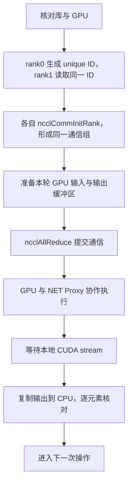
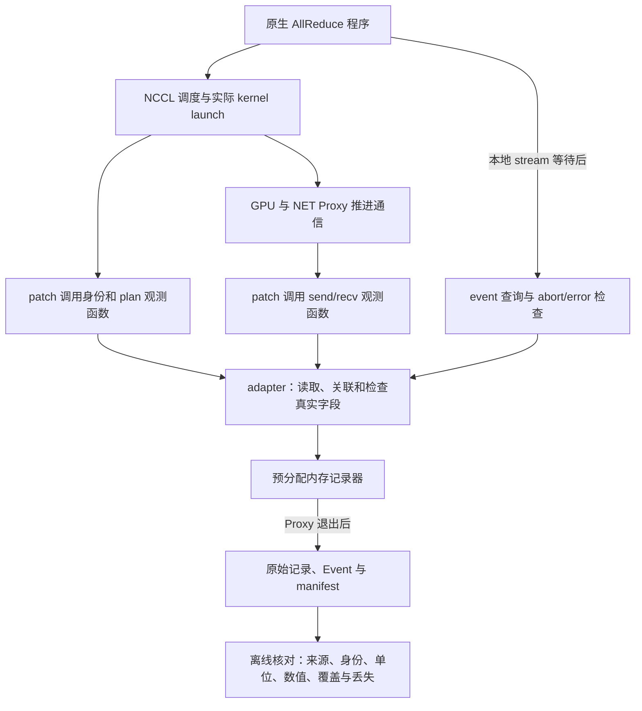

# M1—M3：实验设计、实现逻辑与证据解释

这份文档解释我们为什么做这些实验、怎样从研究问题拆出组件，以及代码如何产生可以核查的证据。它不是上传下载清单，也不是新的执行计划。范围、里程碑顺序和动态进度仍以[核心复现执行计划](../plans/Mycroft_26日开发路线图.md)为准；Crater 的具体命令见对应实验 README。

本文依据 2026-10-03 的工作区代码和已保存证据编写。必须先区分三种状态：

| 阶段 | 已完成的部分 | 尚未取得的证据 |
|---|---|---|
| M1 | 真实双节点 NET/IB AllReduce；数值、节点、库来源和连接核对通过；已提交 main | 没有可用于诊断的完整周期 state/completion 轨迹 |
| M2 | 记录器、NCCL adapter/patch、构建/启动/打包及核对代码；本地检查通过，Crater 插桩库构建及来源复核通过；r3 双物理节点 NET/IB 运行与采集技术核对通过 | 用户已授权进入 M3 |
| M3 | 非阻塞截止时间开关、NCCL 增量补丁、三组运行与核对框架；Crater 三组真实对照技术核对通过，等待、对端受阻及恢复有证据 | 用户已明确进入 M4；自动 Trigger/RCA 属于 M4 |

“写出了代码”不能替代“实际运行正确”，“程序能运行”也不能替代“研究结论成立”。本文中的 M2 逻辑是已经写出的实现，M3 非阻塞注入与三组对照框架已实现；新库 CUDA 编译与加载、三组真实技术核对已通过；目标等待、对端受阻及恢复已记录，用户已明确进入 M4，M3 已验证；自动诊断尚待 M4 实现。

## 1. 我们究竟要回答什么问题

主线是：**在双节点 NCCL 通信停滞时，用真实进度和连接依赖，判断哪个路径主动受阻、哪些路径因等待它而受到影响。**

例如 rank1 很久没有完成 AllReduce，至少有两种解释：rank1 自己没有及时推进，或者 rank1 在等待 rank0。完成得最晚不能直接证明它是根因。最终诊断需要知道同一次操作中，各条发送、接收路径推进到了哪里，以及它们等待谁。

由此倒推必要证据：

1. 先证明我们选的真实通信路径可以正确运行——M1。
2. 再证明我们能可靠观察这条路径——M2。
3. 放入一个原因已知、可以恢复的延迟，检查轨迹如何变化——M3。
4. 让分析器只根据轨迹恢复异常与依赖，再与已知注入位置核对——M4。

M5 汇总端到端复现与基础开销证据。本轮是小规模、离线分析的方法复现，不宣称已经实现论文的完整实时生产系统。

## 2. M1：先建立真实、正确的目标通信路径

### 2.1 为什么同机双 GPU 的成功还不够

此前 Day15 已完成同机双 GPU AllReduce，实际连接是 P2P/CUMEM。它证明原生程序和项目 NCCL 的基本调用成立，但本轮要观察的是 NET Proxy 的网络推进状态。

因此 M1 使用两个物理节点，每个节点一个 rank/GPU，让数据走已确认的 NET/IB 路径。这是由观测对象决定的必要条件，不是为了增加平台操作。

几个概念在本实验中的对应关系：

| 名称 | 本实验中的含义 |
|---|---|
| Node | 实际物理机器；必须确认两侧不是同一台 |
| Pod | Crater 安排的运行单元；两个 Pod 可以落在同一台 Node，不能仅数 Pod |
| Master / Worker | 平台角色；本实验各一个副本，分别启动 rank0 / rank1 |
| rank | 加入同一 NCCL communicator 的原生进程编号，取 0 或 1 |
| communicator | 这两端共同执行 collective 的通信组 |
| channel | 一次 collective 中的一条工作通道；多个 channel 不表示多次 collective |
| Proxy | CPU 侧推进网络发送、接收等任务的线程逻辑，与 GPU 通信工作协作 |

两个 Pod 都只看到各自分配的一张 GPU，所以 rank0 和 rank1 在各自容器中都使用 `cuda device=0`。这不是两端误用了同一张 GPU；物理 GPU 身份要通过 inventory/UUID 等证据判断。

### 2.2 固定什么，改变什么，观察什么

固定条件：NCCL 2.21.5，两个物理节点，各一个原生 rank/GPU；Float32 Sum AllReduce；要求实际 RING/SIMPLE、NET/IB；两侧加载同一份项目构建库。

原源码固定为 NVIDIA NCCL `v2.21.5-1`，commit：

```text
ab2b89c4c339bd7f816fbc114a4b05d386b66290
```

改变的是消息大小和每次输入值：

| 应用 operation | 每 rank 的 float 数量 | 每次逻辑消息大小 | 每次操作使用的输入 |
|---|---:|---:|---|
| 0—2 | 4 | 16 B | 随 operation 变化 |
| 3—5 | 4096 | 16 KiB | 随 operation 变化 |
| 6—8 | 1048576 | 4 MiB | 随 operation 变化 |

每种大小连续三次，目的是覆盖不同实际 channel 数、连续操作和重复使用缓冲区。九次操作不是充分的性能统计，也没有据此得出大规模吞吐结论。

第 k 次操作：

```text
rank0 每个元素 = 1 + k
rank1 每个元素 = 2 + k
预期两端每个输出元素 = 3 + 2k
```

例如操作 0 两端输入分别为 `[1,1,1,1]`、`[2,2,2,2]`，输出应都为 `[3,3,3,3]`。操作 1 输出应为 5，操作 8 输出应为 19。每次输入变化，是为了发现错误复用了旧结果；检查全部元素，是为了发现只写完一部分输出。

### 2.3 程序如何把这次实验做出来

核心程序在[原生 workload](../../workloads/minimal_allreduce/src/main.cpp)，文件名和 `day15_allreduce` 名称保留用于复用，不意味着退回旧计划。

一次执行分为三段：



**初始化段。** rank0 调用 `ncclGetUniqueId()`，通过共享目录发布原始 ID；rank1 读取同一 ID。两端调用 `ncclCommInitRank(..., 2, id, rank)`。ID 相同是加入同一通信组的条件之一，rank 编号还必须互补，进程也必须实际连接成功。

共享目录传递 ID、就绪状态和结果文件。AllReduce 数组由 NCCL 的实际通信连接传输，不经过这个目录。bootstrap 中出现 TCP 连接，不等于 AllReduce 数据通过 Socket。

**每轮输入段。** 分配两端 GPU send/recv 缓冲区，按公式填充 CPU 输入，再异步复制到 GPU stream。输出先填充可识别的未写状态，便于发现漏写；这个初始化状态不是完成证据。

**提交、等待和检查段。** 以下是程序逻辑简化版，省略了错误处理：

```cpp
mark(..., "api_begin");
ncclAllReduce(send, recv, count, ncclFloat, ncclSum, comm, stream);
mark(..., "api_return");
cudaStreamSynchronize(stream);
mark(..., "stream_sync_return");
cudaMemcpy(output, recv, ...);
verify_result(output, expected);
```

`api_return` 表示这次调用成功返回；GPU 通信工作仍可能继续。`stream_sync_return` 是 CPU 已等待本地 stream 的标记，之后才读取并检查输出。两种时间不能混为 GPU kernel 的精确耗时。

当前源码在两处另外接入了 M2 的初始化/完成入口；M2 开关关闭时跳过。已保存的 M1 真实结果来自当时的未插桩库，不应倒推成已经测试过这些新入口。

### 2.4 如何知道走的是目标路径

M1 不是只看 `result=PASS`。核对分几层：

| 证据 | 它能支持什么 | 单独不能证明什么 |
|---|---|---|
| 版本、加载路径、库 SHA256 | 实际使用指定项目库 | 通信正确或字段语义正确 |
| 不同物理节点身份、不同 GPU | 两端资源确实分离 | 实际采用何种 transport |
| `nNodes 2 localRanks 1` | NCCL 将两端识别为双节点单本地 rank | GPU 与网络全部正常 |
| 实际 Channel 的 `NET/IB` 收发连接 | 本轮使用目标网络路径，没有 Socket/P2P 回退 | 自动证明 GPUDirect RDMA；仅凭名称区分 InfiniBand/RoCE |
| 两端九次全部元素正确 | 这组输入上的通信计算正确 | 完整异常诊断能力 |
| 实际计划的 RING/SIMPLE/channel | 本次被选中的执行计划 | 仅设置环境变量就一定采用此计划 |

源码级运行核对在 [verify_m1.py](../../workloads/minimal_allreduce/verify_m1.py)。资源探针只检查本地资源可见和可打开；真正的数据传输要由 NCCL 运行及连接日志证明。

### 2.5 M1 实际结果与一次真实记录

已保存的真实结果：两侧各九次 AllReduce，18 次逐操作数值检查通过；物理节点、GPU、communicator、库来源及 NET/IB 收发证据齐全。

rank0 实际计划：16 B 和 16 KiB 各使用一个 channel，4 MiB 各使用两个。配置中 channel 上下限设为 2，不代表每次一定用两个，实际计划才是证据。

下面两行从[公开 rank0 摘录](../../results/samples/e06/m1/rank0/run.log)选取，保留真实内容：

```text
rank=0 operation=0 count=4 expected=3 result=PASS
rank=0 operation=1 count=4 expected=5 result=PASS
```

结合相邻实际选择记录中的 `RING, SIMPLE`、`nChannels 1`、`count 4 (nbytes 16)`，可以解释为：第一次操作处理四个 float、逻辑大小 16 B、本次计划使用一个 channel，结果全部正确。选择记录中的 `chunkCount` 等内部参数不能直接当作本次实际逻辑消息大小。

### 2.6 为什么作业曾退出 1，但 M1 后来通过了

首轮缺少 verbs 运行库，尚未进入真实通信；补库后重试，两个 rank 的 probe、workload 编译和通信都成功。重试作业整体退出 1，是离线核对器误判应用阶段缺失。

当时一条应用记录用多次输出操作拼成，Proxy 后台 TRACE 可以插入这些片段之间。公开摘录保留了这个现象，例如 operation 2 的 `api_begin` 被 TRACE 插入，`time_ns` 出现在下一行。

修复后的核对器只按已识别的完整后台 TRACE 恢复应用记录：拼回原片段，不补造时间或字段，不改原日志。rank0 恢复两行，rank1 恢复五行；重新核对后通过。恢复视图用于应用记录对账，不能据此分析被重排 Proxy TRACE 的精确时序。

证据入口：

- [offline-recheck.txt](../../results/samples/e06/m1/offline-recheck.txt)：实际离线复核结果与逐操作 channel 数。
- [provenance.json](../../results/samples/e06/m1/provenance.json)：原整体退出码、摘录筛选、脱敏和使用限制。
- [M1 README](../../workloads/minimal_allreduce/M1_README.md)：运行方式、失败原因和实际验收解释。

历史报告末尾仍为 `PENDING_USER_REVIEW`，是当时保存的报告；之后用户明确进入 M2，当前计划将 M1 标为已验证。保留旧报告，不把历史文字改成新的验收状态。后续源码的整行 `fwrite` 修复尚未在这次历史运行中执行。

## 3. M2：从必要证据推导组件，而不是先堆文件

### 3.1 M1 还缺什么

M1 已经知道“这次通信做对了”，但对于某个未结束的操作，还缺少可关联、可重复观察的中间状态。M2 的研究问题是：**能否可靠记录同一次真实操作的身份、每条连接的进度和本地整体完成？**

证据需求与组件的对应关系：

| 必要问题 | 实现选择 | 为什么需要 |
|---|---|---|
| 这是哪次操作、哪条连接？ | operation/channel/peer 关联 | 避免把不同操作、rank 或方向混合 |
| 当前停在哪个推进环节？ | NET 观测点及 adapter | 从真实状态读取数据，解释单位与方向 |
| 无进展持续了多久？ | 周期记录器 | 不变化时也保留快照，留下窗口 |
| 本地整个操作结束了吗？ | 实际 stream event 与错误检查 | 网络子任务结束不足以代表整个 collective |
| 记录能否被信任？ | 丢失统计、原始记录和核对器 | 区分通信现象、实现错误和采集缺证 |

### 3.2 各组件如何配合



M2 没有新增完整分析器。它准备的是 M4 所需的可信输入。`src/mycroft/schema` 定义 Event 的格式；记录能符合格式，还必须继续核查来源和观测语义。

### 3.3 patch：为什么必须修改 NCCL 的调用位置

从外部仅调用 `ncclAllReduce`，拿不到 Proxy 每次推进的内部字段。补丁的职责是在真实执行位置调用项目观测函数，完整文件见 [nccl-2.21.5-m2.patch](../../instrumentation/nccl-2.21.5/day16/nccl_adapter/nccl-2.21.5-m2.patch)。

| 原有位置 | 加入的调用 | 读取此处的理由 |
|---|---|---|
| collective 加入 plan | `mycroftM2Collective` | 检查算法、协议、逻辑大小及单操作计划 |
| 实际 kernel launch 后 | `mycroftM2Launched` | 在真正执行 stream 上放置完成 event |
| `uploadProxyOps` 推进历史计数前 | `mycroftM2Identity` | 绑定该计划实际使用的 collective 序号 |
| `SaveProxy` 保存连接任务前 | `mycroftM2Attach` | 取得真正的 channel、communicator peer 和方向 |
| NET 进度回调及发送条件满足处 | send/recv sample、`mycroftM2Ready` | 保留真实累计状态与观察到的可提交边界 |
| Proxy 线程成功 join 后 | `mycroftM2ProxyStopped` | 确认记录生产者已退出，导出不与写入并发 |

新增成员在 CPU 侧 Proxy 结构中；没有把身份字段塞进 GPU work，也没有实现 Graph、多 stream 或完整 P2P 采集。这些边界减少本轮要验证的执行形式，不增加远期兼容性门槛。

### 3.4 adapter：怎样把一条状态归到某次操作

adapter 源码在 [mycroft_m2.cc](../../instrumentation/nccl-2.21.5/day16/nccl_adapter/mycroft_m2.cc)。它负责读取 NCCL 字段并组装记录，内存记录器不直接依赖 NCCL 类型。

身份的核心是：

```cpp
operation = {comm->commHash, historical_base, comm->rank};
accept(trace::record_operation_begin({operation, started_ns, logical_bytes}));
```

`commHash` 标识 communicator；历史序号候选标识这次 collective；rank 区分两端。`op_seq_candidate` 保留 candidate 名称，是因为跨 rank 对应还必须经真实运行核对。

源码中的通用关系为 `历史 base + plan 内 collective ordinal`。当前支持单操作 plan，ordinal 为 0，所以直接用该次真实 base。不能把应用打印的 operation 或 INFO 的 `comm->opCount` 不经验证当成通用 NCCL 身份。

同一操作可能参加多个 channel。adapter 遍历实际 `channelMask`，绑定实际 channel ID；不能把 GPU block 编号直接当 channel。随后 `mycroftM2Attach()` 把身份写进 Proxy op，`ProxyOpToArgs` 再传给每个 sub。后续快照从 sub 中取身份，不根据“当前最新 operation”猜测旧任务归属。

连接还要附带 peer 和 send/recv 方向。这里取 communicator peer，不直接使用网络 transport 的内部 `tpRank`。本地 `connection_id` 是紧凑编号，不能比较两台机器的编号来判断连接相同；对端关系通过 operation/channel/peer/direction 恢复。

### 3.5 发送侧三种进度怎样产生

普通未注册缓冲区路径中：

| 量 | 更新或读取的位置 | 允许的解释 |
|---|---|---|
| `gpu_ready_steps` | NCCL 判定当前 slice 满足发送条件、即将尝试 `isend` 时 | Proxy 已观察到的可提交 slice 边界 |
| `transmitted_steps` | 原有 `isend` 返回非空 request 后的累计计数 | 请求已提交到网络的进度 |
| `done_steps` | 原有网络 `test` 确认完成后的累计计数 | 相应网络请求完成的进度 |

readiness 的关键代码是：

```cpp
const uint64_t ready = sub->transmitted + args->sliceSteps;
sub->mycroft_m2_ready = std::max(sub->mycroft_m2_ready, ready);
```

这段只在原代码的发送条件满足时调用。一个 slice 的发送可能多次尝试，使用最大边界去重，不能每次尝试都加一次。它受 Proxy 的观察机会与发送信用窗口限制，**不是全部 GPU 数据精确就绪量**，也不足以单独证明 GPU 或网卡发生物理故障。

这些 raw 计数使用 Proxy step。导出 Event 时，用同一个 `slice_steps` 做精确整数转换。例如下面是单位说明，**不是实测值**：

```text
nsteps=16，slice_steps=2
ready_steps=8，transmitted_steps=6，done_steps=4
→ total_chunks=8，gpu_ready=4，rdma_transmitted=3，rdma_done=2
```

Event 的 `chunks` 在这里是归一化 Proxy slice 数，不是 Ring 算法的块数量，也不是字节。逻辑消息大小另取 collective 的 `nBytes`。`step_base` 是连接计数溯源信息，不能加进本次操作的累计进度。不能整除、累计倒退或顺序关系不成立时，应拒绝转换，不能靠舍入制造通过。

### 3.6 为什么接收侧另存一份

同名字段在不同方向上含义不同，发送状态不足以解释对端等待：

| 接收侧字段 | 含义 |
|---|---|
| `posted_steps` | 接收请求已提交 |
| `received_steps` | 接收网络请求已完成 |
| `transmitted_steps` | flush 就绪后向 GPU 发布数据的进度，不是发送侧的 isend |
| `done_steps` | GPU 消费确认，不能直接当整个 collective 完成 |

因此接收侧导出独立 raw 文件，不塞进发送侧的 Event payload。固定源码的 sub 有 `flushed` 字段，但目标 NET 路径没有独立维护它，不能凭字段名把它当作有效进度。注册缓冲区还有不同语义，本轮显式拒绝，不扩展为必做实验。

### 3.7 completion：怎样避免把局部结束误当整体结束

`mycroftM2Collective()` 检查普通、单操作计划、RING/SIMPLE、float32、未注册缓冲区和目标 stream。`mycroftM2Launched()` 在实际 kernel launch 后，将 CUDA event 记录到实际 stream，确认它与用户 stream 对应。

应用流程目前是：

```text
ncclAllReduce 返回
→ cudaStreamSynchronize 等待
→ mycroftM2Complete 检查 event、abort 和异步错误
→ 记录 completion
→ 应用打印 stream_sync_return
→ 逐元素验证结果
```

query 之前还检查 `event_recorded`，避免未记录过的 event 被当作本次操作的完成。下次串行操作之前重设状态，避免复用上一次完成。

这个 completion 表示本地整体操作已完成的 CPU 观测时刻。单操作 plan 让整个 plan 的完成可以关联到本次 collective；多操作计划不能照此给每个操作伪造独立结束时间。

应用标记与 adapter 均使用本进程 `CLOCK_MONOTONIC`，核对器检查开始观测落在相应 API 调用内、completion 落在相应等待区间内。跨节点的原始 ns 不能直接相减；也不能把这些 CPU 时间称为精确 GPU 执行时间。Proxy 的最终收尾状态可能在 CPU 后续回调才被观察到，不能仅按观测时间反推全部内部动作的先后。

### 3.8 记录器：为什么使用预分配内存、周期和丢失计数

实现见 [operation_trace.h](../../instrumentation/nccl-2.21.5/day16/include/operation_trace.h) 和 [operation_trace.cpp](../../instrumentation/nccl-2.21.5/day16/src/operation_trace.cpp)。

设计来自一个约束：**观察通信时，采集本身不能等待磁盘或 reader。**

```text
初始化：分配固定数量记录槽
运行：校验记录 → 原子预约一个槽 → 写入结构体
满容量：增加 dropped，不阻塞、不覆盖旧记录
停止：确认所有生产者退出
导出：建立关联、格式化 JSON、写文件
```

多个生产者写各自预约的槽；只有生产者停止后才读取完整结果。当前 workload 配置为 262144 条记录、10 μs 采样周期，容量包括身份/plan/状态/完成记录，不仅是快照条数。

采样使用每个 operation/connection/direction 独立的 state：首次观察记录；之后若未到期跳过，到期再记录，**不要求计数发生变化**。

示意：同一连接在两个观测时刻都是 `(ready, transmitted, done)=(4,3,2)`。保留两条才能说明这段窗口没有进展；若只记变化，停滞时恰好没有记录。

采样由 Proxy 回调检查到期，不是独立定时线程，所以 10 μs 是门槛，不保证严格每 10 μs 一条。回调被线程调度或阻塞影响时，实际间隔可以更大。后续注入必须保持回调运行。

导出前还要确认实际 Proxy join：`ncclCommAbort` 会忽略部分清理错误，仅凭它返回成功不足以证明生产者已退出。若进程被强杀、尚未导出，内存证据可能丢失；这种缺证不能自动解释成通信根因。

### 3.9 为什么同时导出 raw、Event 和 manifest

| 输出 | 留下它的理由 |
|---|---|
| `send-/recv-rankN.jsonl` | 保留原始 step、计数和连接，能核查归一化是否正确 |
| `channel-map.jsonl` | 保存 operation begin、实际 channel 与 peer 关联 |
| `plan-map.jsonl` | 保存 plan/stream 绑定与原始 completion，能查重复或错误关联 |
| `rankN.jsonl` | 使用已有 Event v2，供后续轨迹恢复和分析 |
| `capture-manifest.json` | 容量、周期、丢失、无效/不支持及关联错误 |
| `adapter-manifest.json` | 生产端的观测方法、范围、错误及线程退出声明 |

通用记录器不知道调用者是不是真实 NCCL，因此其 manifest 和 Event source 保留“未验证”标记。adapter 声明也不能单独证明真实正确性。离线核对要结合构建、加载、实际网络、数值及 raw/Event 对账；不会把原始标记改成一份自我认证的证据。

核对入口是 [verify_capture.py](../../instrumentation/nccl-2.21.5/day16/verify_capture.py)，包含：

1. 固定原源码、patch/新增源码、新库及实际加载来源一致。
2. 两端进程成功、真实双节点 NET/IB、全部输出正确。
3. 九个操作的大小、channel、peer、单操作 plan 和 completion 完整且不重复。
4. 原始计数单位及单调性正确，Event 与 raw 一致。
5. 实际多 channel 操作得到验证，至少存在一个周期中间窗口。
6. 没有丢失、无效记录、不支持路径或关联缺证。

任何一项不足都不能标为 M2 通过。首轮真实包因两侧物理主机标识相同而拒绝完整核对；之后 r2 普通用户启动时 RDMA CQ 创建失败，r3 两侧改用 root 后双节点运行与完整技术核对通过。失败原始记录保留，M2 已验证，用户已授权进入 M3。本地手写证据只用于测试核对器会如何接受一致格式、拒绝错误组合。

### 3.10 包里的辅助组件为何存在

| 文件或组件 | 作用 | 与研究核心的关系 |
|---|---|---|
| `nccl-source.tar` 与 NVIDIA 许可证 | 固定版本的原始通信实现 | 所观察的真实系统；保留上游来源和许可证 |
| patch + adapter | 把观测接入执行路径，读取和关联真实状态 | M2 核心 |
| 记录器 + Event schema | 保存可恢复的进度与完成轨迹 | M2 核心及后续分析输入 |
| 原生 workload | 产生可核查输入、操作序列和正确输出 | 实验驱动与独立正确性检查 |
| `prepare_m2.py` | 校验上传内容、建立独立源码副本、应用补丁 | 来源和可重现性支持 |
| `build_m2.py` | 编译新库，检查版本、加载、导出接口及 hash | 构建支持；不代表已做 GPU 实验 |
| `run_m2.py` | 复用 M1 的双侧协调，启动采集并核对结果 | 实验执行支持 |
| 打包脚本 | 保存必要证据，减少逐文件搬运 | 操作支持，不是另一个研究里程碑 |

源码和对象文件在容器临时目录生成；共享目录保留最终共享库、头文件和证据。原始 `third_party/nccl` 保持干净，修改保存在 patch 中。M2 manifest 明确源码经过修改，不能套用 M1 的 clean-source 结论。

`make` 调用 g++ 编译 CPU 代码、nvcc 编译 GPU 代码，再链接新库。仅两个新增 host 源文件采用 C++17，共享 hook 头保持 C++11 兼容，GPU 编译沿用上游。workload 通过 g++ 链接指定库，并检查实际加载路径；新增接口还通过 `dlsym` 确认存在。

包不包含 CUDA。编译使用已验证镜像中的 CUDA 12.5 devel，需要 nvcc、头文件和开发库，但不需要分配 GPU；真实执行才需要 GPU/RDMA。无需新增 CMake、PyTorch 或 pip 依赖。Crater 的 PyTorch 作业类型只用于安排双 Role，不意味着实验程序依赖 torchrun。

实际操作入口见 [M2 README](../../instrumentation/nccl-2.21.5/day16/README.md)。这些脚本减少你的操作负担；理解观测来源和判断证据，才是你参与实验的核心。

## 4. M3：用已知原因检验观测是否有解释力

### 4.1 为什么正常轨迹还不足以证明诊断能力

正常运行时，计数推进、最后完成，无法证明遇到异常时我们能区分主动受阻者和等待它的其他路径。M3 需要给出一个受控的已知原因，观察它如何体现在轨迹上。

原因选在**满足发送条件之后、提交网络请求之前**：只让指定 rank/op/channel 的请求暂缓提交。到期恢复，因此仍可检查整个操作最终数值正确。这是软件提交延迟，不代表物理 GPU/NIC/RDMA 故障。

### 4.2 三组对照分别排除什么解释

| 组别 | 使用的行为 | 比较目的 |
|---|---|---|
| A：未插桩正常 | 原始固定 NCCL 正常通信 | 保留原系统基线 |
| B：仅插桩正常 | 加入采集，延迟开关关闭 | 与 A 比较，识别插桩自身影响 |
| C：插桩加延迟 | 同 B 的实现，打开精确选择的延迟 | 与 B 比较，检查新增窗口是否符合注入机制 |

三组保持同一范围、输入检查和运行设置，记录工具链、库、实际 transport/channel 与必要 timing。B/C 使用同一份包含默认关闭注入开关的新 M3 库，以开关产生差异；旧 M2 库不包含该增量实现。A 的历史 M1 结果可以复用为已有证据，但不能伪装成与未来 B/C 同一时刻、相同条件下的新对照测量。

三组 runner 已实现，在同一受控作业组合中连续执行并自动归档。初值 rank0/op6/channel0、100 ms 在本轮真实实验中命中：实际等待 100.000906 ms，目标等待区间有 9,725 条样本，两侧对应 channel0 受阻、channel1 提前完成，释放后恢复；本轮窗口足够，不外推到其他配置；接口、已实现组件及判断边界见 [M3 README](../../instrumentation/nccl-2.21.5/m3/README.md)。

### 4.3 注入逻辑为什么必须非阻塞

以下伪代码概括现有实现，核心代码为 [`send_delay.h`](../../instrumentation/nccl-2.21.5/m3/include/send_delay.h)；实际 NCCL 接入已在 Crater 编译、加载并完成三组 GPU 对照技术核对：

```text
进入目标发送路径，且本 slice 已满足发送条件：
    记录已观察到的 readiness
    若匹配目标，且本次注入尚未开始：
        release_deadline = 本地单调时间 + 设定延迟
    若属于此次注入，且还没到 release_deadline：
        暂不提交目标请求，本轮继续处理其他任务
    否则：
        执行正常 isend
```

需要保存“是否已开始”和 deadline，不能每轮把 deadline 重新设为“现在 + 延迟”，否则永远无法释放；也不能对每个后续 slice 无意重复注入。

不能用 `sleep` 冻结整个 Proxy：同一线程还可能负责其他连接和采样，sleep 会让“目标请求延迟”变成“整个线程及观察停止”，混淆主动原因与影响范围。

非阻塞意味着其他任务继续获得执行机会，不意味着其他任务必定继续产生进展。协议依赖仍可能让对端或其他 channel 连带等待，这正是要观察和解释的传播。

### 4.4 预期会看到什么

在目标请求确已就绪并命中选择条件时，预期：

1. 目标连接的 readiness 已观察到，而 transmitted 暂不推进，形成有持续快照的提交受阻窗口。
2. done 无法完成尚未提交的那部分；已有请求是否继续完成要看实际状态，不预先填造计数。
3. 对端接收和相关 GPU 工作可能等待；整体 completion 推迟，最终到期释放后恢复。
4. 三组最终输出仍满足 `3+2k`，没有通过破坏数据或取消操作制造“异常”。

采集结束后的 completion 不能抹掉中间窗口。数据文件同时保留截止范围与过程中状态，后续分析应能重建“等待发生过、持续多长、之后恢复”。不同主机原始时间仍不能直接对齐；依赖先按操作/channel/peer 恢复。

### 4.5 什么结果会否定本次设计或使证据不足

| 观测 | 应如何判断 |
|---|---|
| 注入没有命中目标或命中其他操作/连接 | 选择器或身份关联有问题，不能宣称目标实验成功 |
| 延迟期间快照停止、记录丢失 | 观察窗口不足，不能把空白当成可定位的停滞 |
| 无法释放或数值错误 | 注入实现破坏了实验，需要修复 |
| 关闭注入后仍出现同类新增异常 | 检查采集开销、资源波动和实现残留，不能直接归因于开关 |
| 两端都变慢，但状态无法区分主动延迟与依赖传播 | 保留并列候选和缺证，不能按最晚 rank 指定根因 |
| 最终完成正确但中间没有有效受阻窗口 | 只证明程序最终成功，不足以支持异常对照 |

最终定位分析属于 M4。分析器不能把注入配置当成答案输入；注入位置只用于事后核对预测。否则即使报告写对，也没有证明方法能从轨迹发现原因。

## 5. 怎样独立核查，而不只是搬运结果

双方分工：Codex 实现、检查、配置和整理；你重点理解实验假设、观察关键现象并参与研究判断。你不必手写全部实现或阅读所有日志，也不需要通过额外考试才推进。

### 5.1 阅读代码的顺序

围绕以下问题阅读即可，不需要通读整个 NCCL：

1. 看 workload：输入为何随操作变化，提交、等待和结果检查分别在哪里？
2. 看 patch：观测函数被放在原执行路径的什么位置？
3. 看 adapter：同一次操作怎样传到 channel/peer/sub，readiness 和 completion 分别取自哪里？
4. 看记录器：无进展是否继续记录，容量不足怎样显式留下证据？
5. 看核对器：它为何拒绝缺证，哪些通过条件依赖真实运行？

从仓库根目录可以快速定位函数：

```bash
rg -n 'submit_allreduce|wait_for_collective|capture.complete|verify_result' workloads/minimal_allreduce/src/main.cpp
rg -n 'mycroftM2Identity|mycroftM2Attach|mycroftM2Ready|mycroftM2Complete' instrumentation/nccl-2.21.5/day16/nccl_adapter/mycroft_m2.cc
rg -n 'CaptureStatus append|CaptureStatus sample|export_stopped' instrumentation/nccl-2.21.5/day16/src/operation_trace.cpp
```

这些检索是核查入口，不是新增必做学习任务。发现旧注释与实际 adapter 不一致时，以具体实现和证据为准；`day15/day16` 路径是兼容命名，不是执行路线。

### 5.2 M1 可以立即复核的真实证据

先根据第 2 节理解预期，再运行：

```bash
python3 workloads/minimal_allreduce/verify_m1.py results/samples/e06/m1
```

预期得到两端九次操作、18 项结果检查、不同物理节点及 NET/IB 的技术核对通过，逐操作 channel 为 `1,1,1,1,1,1,2,2,2`。该命令是复查已有真实摘录，不会启动新的 GPU 实验。

要记得：公开摘录经过脱敏和筛选，不是完整 Proxy 时序；不能拿它补造 M2 的中间状态。

### 5.3 M2 返回结果后，先看什么

先检查来源与数值，再挑一个操作沿 identity → channel/peer → send/recv → completion 追踪。回答：

- 这些记录是否确实属于同一次操作和目标连接？
- 进度单位是什么，两个快照间是推进还是保持不变？
- completion 的来源是否满足本地整体结束条件？
- 有没有丢失、不支持形式或采样断档限制解释？

核对命令是：

```bash
python3 instrumentation/nccl-2.21.5/day16/verify_capture.py <实际解包目录>/m2-results
```

`m2_technical_checks=PASS` 表示程序核对这份运行证据通过；它仍需要结合观测范围解释，不能自动扩大为所有 NCCL 形式都支持。当前 r3 为双物理节点上的真实 NET/IB 采集，本地独立技术核对已通过，M2 已验证，用户已授权进入 M3；不据此扩大支持范围。

### 5.4 M3 返回结果后，参与哪项判断

比较 B/C 的目标窗口，而不是只看最终退出码：提交受阻是否出现在预期连接，窗口中是否一直有观测，释放后是否恢复，对端等待是否与已知依赖一致。再结合 A/B 判断采集本身的影响。

如果报告定位 rank1，而主动延迟设在 rank0，不能直接改报告答案；应检查它是否误把传播受害者当成原因、身份是否混合、必要接收证据是否不足。允许负结果，不能为了通过而把注入位置直接喂给分析器。

## 6. 说明文档与执行记录的职责

本文集中解释设计推导、组件理由和代码逻辑；不另立路线，不追加实验门槛。真实运行有新证据时更新当前计划的状态，并在实验 README 保存可运行方式及必要样例。

相关入口：

- [唯一执行计划：M1—M5](../plans/Mycroft_26日开发路线图.md)
- [M1 操作与真实结果说明](../../workloads/minimal_allreduce/M1_README.md)
- [M2 实现接口、实验配置与支持边界](../../instrumentation/nccl-2.21.5/day16/README.md)
- [NCCL 候选观测点与字段含义](../../instrumentation/nccl-2.21.5/tracepoints.md)
- [Event 字段来源与限制](event-field-sources.md)

主 agent 负责实现和进度；讲解 agent 已为本文提供结构建议，并独立核对 M1 证据、M2 语义边界和 M3 对照设计。终稿逐项校核由主 agent 完成。代码、CPU fixture、真实运行和计划中的实现，在讲解及验收时始终分别标明。
