# NCCL Communicator 与 AllReduce Host 提交路径

本文重点整理 NCCL communicator 初始化，以及一次普通多 rank `ncclAllReduce()` 在 Host 端形成任务和 kernel plan 的过程。开头的模块依赖图同时给出 GPU、Proxy 和 Transport 的后续边界，便于把局部源码放回完整执行链理解。

源码基线：本地 NCCL master，commit `5067397c2676d5aed50042fc39e5c8ee96eb0027`。不同版本的函数和字段可能变化。

## 1. 总体流程

```text
初始化 communicator

外部框架准备 rank / nranks / CUDA device
  -> ncclGetUniqueId()
  -> 外部分发 ncclUniqueId
  -> ncclCommInitRank()
  -> bootstrapInit()
  -> fillInfo() 生成本地 peerInfo
  -> bootstrapAllGather() 交换 peerInfo
  -> 拓扑、Channel、transport 初始化
  -> 本地 ncclComm ready


提交一次 AllReduce

ncclAllReduce()
  -> 局部 struct ncclInfo info
  -> ncclEnqueueCheck()
  -> taskAppend()
  -> collTaskAppend()
  -> struct ncclTaskColl *t
  -> comm->planner.collSorter
  -> ncclPrepareTasks()
  -> comm->planner.collTaskQueue
```

初始化过程建立长期通信上下文；AllReduce 提交过程使用这个上下文创建一次通信任务。

### 1.1 模块依赖总图

图中实线表示主要调用或数据转换关系，虚线表示初始化结果为后续模块提供长期状态。Host 侧对象依次转换，GPU 与 Proxy 则通过 Channel 的连接控制区和数据缓冲区协作。

```mermaid
flowchart TB
    APP["训练框架 / 用户进程"]

    subgraph INIT["① Communicator 初始化"]
        INIT_API["ncclCommInitRank()"]
        BOOT["bootstrap<br/>交换初始化信息"]
        PEER["peerInfo<br/>各 rank 的机器和 GPU 信息"]
        TOPO["Topology<br/>分析 GPU、PCIe、NVLink 和 NIC"]
        CHANNEL_INIT["Channel 初始化<br/>Ring / Tree 拓扑"]
        CONN["Transport 连接<br/>P2P / SHM / NET"]
        COMM["struct ncclComm<br/>长期通信上下文"]

        INIT_API --> BOOT
        BOOT --> PEER
        PEER --> TOPO
        TOPO --> CHANNEL_INIT
        CHANNEL_INIT --> CONN
        CONN --> COMM
    end

    APP --> INIT_API

    subgraph HOST["② AllReduce Host 提交与调度"]
        API["ncclAllReduce()"]
        INFO["struct ncclInfo<br/>临时 API 描述"]
        TASK["struct ncclTaskColl<br/>Host 通信任务"]
        SORTER["planner.collSorter"]
        PREPARE["ncclPrepareTasks()<br/>选择 algorithm / protocol"]
        TASK_QUEUE["planner.collTaskQueue"]
        DEVWORK["struct ncclDevWorkColl<br/>GPU 工作描述"]
        WORK_QUEUE["planner.collWorkQueue"]
        PLAN_PREP["ncclLaunchPrepare()"]
        SCHEDULE["scheduleCollTasksToPlan()<br/>划分 Channel 和 chunk"]
        PLAN["struct ncclKernelPlan<br/>一次 kernel launch 工作包"]
        FINISH["finishPlan()<br/>组织 batch 和 kernel 参数"]
        KARGS["struct ncclDevKernelArgs<br/>kernel 启动参数"]
        UPLOAD["uploadWork()<br/>复制 GPU work"]
        LAUNCH["ncclLaunchKernel()<br/>提交到 CUDA stream"]

        API --> INFO
        INFO --> TASK
        TASK --> SORTER
        SORTER --> PREPARE
        PREPARE --> TASK_QUEUE
        TASK_QUEUE --> DEVWORK
        DEVWORK --> WORK_QUEUE
        TASK_QUEUE --> PLAN_PREP
        WORK_QUEUE --> PLAN_PREP
        PLAN_PREP --> SCHEDULE
        SCHEDULE --> PLAN
        PLAN --> FINISH
        FINISH --> KARGS
        FINISH --> UPLOAD
        KARGS --> LAUNCH
        UPLOAD --> LAUNCH
    end

    APP --> API
    COMM -. "提供 rank、Channel、连接和拓扑" .-> API
    COMM -. "提供算法与传输状态" .-> PREPARE
    COMM -. "提供 devComm 和 CUDA stream" .-> LAUNCH

    subgraph GPU["③ GPU kernel 与 Ring AllReduce"]
        STREAM["CUDA stream<br/>等待前序计算或事件"]
        KERNEL["NCCL GPU kernel<br/>ncclKernelMain()"]
        BLOCK["CUDA block<br/>一个 block 对应一个有效 Channel"]
        DEVCHANNEL["ncclDevChannel<br/>prev / next / Ring 拓扑"]
        LOADWORK["加载 ncclDevWorkColl"]
        RUNRING["runRing()"]
        RS["ReduceScatter<br/>接收、规约、转发"]
        AG["AllGather<br/>接收、保存、转发"]
        PRIM["Primitives<br/>send / recv / reduce / copy"]

        STREAM --> KERNEL
        KERNEL --> BLOCK
        BLOCK --> DEVCHANNEL
        BLOCK --> LOADWORK
        DEVCHANNEL --> RUNRING
        LOADWORK --> RUNRING
        RUNRING --> RS
        RS --> AG
        RS --> PRIM
        AG --> PRIM
    end

    LAUNCH --> STREAM
    KARGS --> KERNEL
    COMM -. "提供 devComm 和 device Channel" .-> KERNEL

    subgraph PROXY["④ GPU 与 Proxy 协作"]
        CONNBUF["连接控制区与缓冲区<br/>head / tail / FIFO"]
        PROXY_OP["struct ncclProxyOp<br/>Channel 网络工作"]
        PROXY_THREAD["NCCL Proxy thread"]
        READY["GPU 数据 ready"]
        SUBMIT["网络传输已提交"]
        DONE["网络传输已完成"]

        PROXY_OP --> PROXY_THREAD
        PROXY_THREAD --> CONNBUF
        CONNBUF --> READY
        READY --> SUBMIT
        SUBMIT --> DONE
    end

    PLAN --> PROXY_OP
    PRIM --> CONNBUF
    CONNBUF --> PRIM

    subgraph TRANSPORT["⑤ 数据传输层"]
        SELECT["Transport 选择"]
        P2P["P2P<br/>GPU Direct / IPC"]
        SHM["SHM<br/>共享内存"]
        NET["NET Transport"]
        NETIB["NET/IB Plugin"]
        QP["RDMA QP"]
        NIC["NIC / 网络交换设备"]
        REMOTE["远端 rank"]

        SELECT --> P2P
        SELECT --> SHM
        SELECT --> NET
        NET --> NETIB
        NETIB --> QP
        QP --> NIC
        NIC --> REMOTE
    end

    CONN -. "初始化时确定传输类型" .-> SELECT
    PROXY_THREAD --> SELECT
    REMOTE --> CONNBUF

    subgraph COMPLETE["⑥ 完成与结果可用"]
        CH_DONE["当前 Channel 完成"]
        ALL_CH["所有 Channel 完成"]
        K_DONE["NCCL kernel 完成"]
        STREAM_DONE["CUDA stream 越过 NCCL kernel"]
        RESULT["recvbuff 结果可用"]
        RECLAIM["task / plan 回收到内存池"]

        CH_DONE --> ALL_CH
        ALL_CH --> K_DONE
        K_DONE --> STREAM_DONE
        STREAM_DONE --> RESULT
        K_DONE --> RECLAIM
    end

    PRIM --> CH_DONE
```



这张图包含三条需要分别理解的依赖链：

```text
初始化依赖
peerInfo -> topology -> Channel -> transport -> communicator

Host 对象转换
ncclInfo -> ncclTaskColl -> ncclDevWorkColl
         -> ncclKernelPlan -> ncclDevKernelArgs

运行时进度依赖
GPU primitive -> GPU ready -> Proxy 提交网络 -> 网络完成
              -> Channel 完成 -> kernel 完成 -> recvbuff 可用
```

## 2. 官方 API 语义

### 2.1 Communicator

NVIDIA User Guide 对 communicator 的基本约束：

- communicator 包含 `n` 个 CUDA device，每个 device 对应一个唯一 rank，范围为 `[0, n-1]`。
- 同一个 CUDA device 不能在同一个 communicator 中作为多个 rank 重复使用。
- `ncclGetUniqueId()` 生成的 ID 必须通过 MPI、socket、store 等 CPU 通信方式分发给所有参与者。
- `ncclCommInitRank()` 创建的每个本地 communicator 对象固定绑定一个 rank 和一个 CUDA device。

参考：[Creating a Communicator](https://docs.nvidia.com/deeplearning/nccl/user-guide/docs/usage/communicators.html)

### 2.2 AllReduce

AllReduce 对各 rank 的输入执行规约，并把相同结果写入每个 rank 的 `recvbuff`。

对于一次完整 collective：

- communicator 中每个 rank 都需要调用匹配的 collective；
- 各 rank 的 `count` 和 `datatype` 必须一致；
- 各 rank 的操作顺序必须匹配；
- buffer 指针是各进程的本地指针，不要求指针值相同。

参考：[Collective Operations](https://docs.nvidia.com/deeplearning/nccl/user-guide/docs/usage/collectives.html)、[Collective Communication Functions](https://docs.nvidia.com/deeplearning/nccl/user-guide/docs/api/colls.html)

### 2.3 Group 和 CUDA stream

`ncclGroupStart()/ncclGroupEnd()` 用于：

- 一个 Host 线程管理多张 GPU；
- 聚合多个 collective，减少 launch 开销；
- 合并多组 send/recv。

group 中间的 collective 调用返回时，工作不一定已经进入 CUDA stream；最外层 `ncclGroupEnd()` 才提交整组操作。

NCCL collective 与传入的 CUDA stream 关联。Host 调用完成不等于 GPU 通信完成；GPU 完成状态需要通过 CUDA stream 同步或 CUDA event 判断。

参考：[Group Calls](https://docs.nvidia.com/deeplearning/nccl/user-guide/docs/usage/groups.html)、[CUDA Stream Semantics](https://docs.nvidia.com/deeplearning/nccl/user-guide/docs/usage/streams.html)

## 3. Communicator：逻辑通信组与本地对象

### 3.1 类型和指针

```c
typedef struct ncclComm *ncclComm_t;
```

- `struct ncclComm`：communicator 的内部结构体类型。
- `struct ncclComm *`：指向本地 communicator 对象的指针类型。
- `ncclComm_t`：`struct ncclComm *` 的类型别名。
- `ncclComm_t comm`：communicator 指针变量。

源码：[`src/nccl.h.in:36`](../nccl/src/nccl.h.in)、[`src/include/comm.h:523`](../nccl/src/include/comm.h)

### 3.2 跨进程关系

同一个逻辑 communicator 在不同进程中对应不同的本地对象：

```text
进程0                                      进程1

struct ncclComm *comm0                    struct ncclComm *comm1
          |                                         |
          v                                         v
本地 ncclComm 对象                         本地 ncclComm 对象
rank=0, nRanks=2                          rank=1, nRanks=2
cudaDev=0                                 cudaDev=1

          \-------- 同一个逻辑 communicator --------/
```

`comm0` 与 `comm1` 不共享指针值，也不指向同一个结构体对象。

同一进程可以持有多个 communicator 指针：

```c
struct ncclComm *dpComm;
struct ncclComm *tpComm;
```

每次 `ncclAllReduce()` 只使用参数中传入的一个 communicator。

## 4. Communicator 初始化

### 4.1 入口参数

```c
ncclResult_t ncclCommInitRank(
    ncclComm_t *newcomm,
    int nranks,
    ncclUniqueId commId,
    int rank
);
```

| 参数 | 类型 | 来源 | 作用 |
|---|---|---|---|
| `newcomm` | `struct ncclComm **` | 调用者提供 | NCCL 通过二级指针返回新建的本地 communicator 指针 |
| `nranks` | `int` | 外部框架 | communicator 的总 rank 数 |
| `commId` | `ncclUniqueId` 值 | `ncclGetUniqueId()` 生成并由外部分发 | 让各进程进入同一次初始化 rendezvous |
| `rank` | `int` | 外部框架 | 当前本地 communicator 在组内的编号 |
| 当前 CUDA device | CUDA 运行时状态 | 调用者预先选择 | 当前 rank 绑定的本地 GPU |

源码：[`src/nccl.h.in:172`](../nccl/src/nccl.h.in)、[`src/nccl.h.in:186`](../nccl/src/nccl.h.in)、[`src/init.cc:183`](../nccl/src/init.cc)、[`src/init.cc:2562`](../nccl/src/init.cc)

### 4.2 初始化顺序

```text
1. 外部框架确定 nranks、当前 rank 和 CUDA device

2. 一个参与者调用 ncclGetUniqueId()

3. 外部框架把 ncclUniqueId 分发给所有参与者

4. 每个参与者调用 ncclCommInitRank()

5. NCCL 创建本地 ncclComm，并写入基础状态
   comm->rank
   comm->nRanks
   comm->cudaDev
   comm->commHash

6. bootstrapInit() 建立初始化控制通道

7. fillInfo() 生成当前 rank 的 ncclPeerInfo

8. bootstrapAllGather() 交换所有 rank 的 peerInfo

9. 根据 peerInfo 和本机信息建立拓扑、Channel 与 transport

10. 本地 communicator 进入可通信状态
```

### 4.3 bootstrap 与 peerInfo

`bootstrapInit()` 是初始化阶段的控制通信函数。正式 P2P/SHM/NET 数据路径尚未建立时，各 rank 通过 bootstrap 交换初始化信息。

`struct ncclPeerInfo` 保存某个 rank 的物理和进程信息，当前相关字段包括：

- communicator rank；
- CUDA/NVML device；
- host 和 process 标识；
- PCI bus 信息；
- GPU UUID；
- GDR 支持；
- 计算能力和内存信息。

每个 rank 先调用 `fillInfo()` 填写自己的 peerInfo，再通过 `bootstrapAllGather()` 获得完整 peerInfo 数组。

```text
逻辑成员关系：ncclUniqueId + rank / nranks

物理路径选择：peerInfo + topology
```

源码：[`src/bootstrap.cc:674`](../nccl/src/bootstrap.cc)、[`src/bootstrap.cc:1194`](../nccl/src/bootstrap.cc)、[`src/init.cc:711`](../nccl/src/init.cc)、[`src/init.cc:1036`](../nccl/src/init.cc)、[`src/include/transport.h:43`](../nccl/src/include/transport.h)

## 5. `struct ncclComm` 的相关结构

`struct ncclComm` 很大。当前路径只关注以下成员：

```text
struct ncclComm
|
|-- memPermanent
|     后备 Host 内存
|
|-- channels[MAXCHANNELS]
|     communicator 的 Channel 状态
|
|-- peerInfo 指针 ------> ncclPeerInfo 数组
|-- topo 指针 ----------> 拓扑对象
|-- bootstrap 指针 -----> bootstrap 状态
|
|-- commHash
|-- rank
|-- nRanks
|-- cudaDev
|-- node / nNodes
|-- localRank / localRanks
|-- nChannels
|
|-- memPool_ncclTaskColl
|     ncclTaskColl 空闲对象池
|
|-- memPool_ncclKernelPlan
|     ncclKernelPlan 空闲对象池
|
\-- planner
      Host 端任务规划状态
```

这里同时存在三种关系：

- 直接成员：`comm->planner`、`comm->memPermanent`、各内存池。
- 固定数组：`comm->channels[MAXCHANNELS]`。
- 指针成员：`comm->peerInfo`、`comm->topo`、`comm->bootstrap`。

源码：[`src/include/comm.h:523`](../nccl/src/include/comm.h)

## 6. AllReduce API 字段

```c
ncclResult_t ncclAllReduce(
    const void *sendbuff,
    void *recvbuff,
    size_t count,
    ncclDataType_t datatype,
    ncclRedOp_t op,
    ncclComm_t comm,
    cudaStream_t stream
);
```

| 字段 | 解决的问题 | 后续去向 |
|---|---|---|
| `sendbuff` | 当前 rank 从哪个本地 GPU buffer 读取输入 | `info->sendbuff → task->sendbuff` |
| `recvbuff` | 当前 rank 把结果写入哪个本地 GPU buffer | `info->recvbuff → task->recvbuff` |
| `count` | 处理多少个 `datatype` 元素 | `info->count → task->count` |
| `datatype` | 每个元素的大小和解释方式 | `info->datatype → task->datatype` |
| `op` | 执行 sum、max 等哪种规约 | 转换为 Host 和 device 规约描述 |
| `comm` | 这次操作属于哪个 communicator | 用于检查状态并找到 `comm->planner` |
| `stream` | 与本地计算按什么 CUDA stream 顺序执行 | 由 planner 收集本批任务涉及的 stream |

`count` 不是字节数。输入数据字节数为：

```c
bytes = count * ncclTypeSize(datatype);
```

源码：[`src/nccl.h.in:496`](../nccl/src/nccl.h.in)、[`src/collectives.cc:168`](../nccl/src/collectives.cc)

## 7. 从 `ncclInfo` 到 `ncclTaskColl`

### 7.1 `ncclInfo`：局部 API 描述

```c
struct ncclInfo {
    ncclFunc_t coll;
    const char *opName;
    const void *sendbuff;
    void *recvbuff;
    size_t count;
    ncclDataType_t datatype;
    ncclRedOp_t op;
    int root;
    ncclComm_t comm;
    cudaStream_t stream;
    int chunkSteps;
    int sliceSteps;
    /* 其他操作使用的字段 */
};
```

`ncclAllReduce()` 创建局部变量：

```c
struct ncclInfo info;
```

然后把 `&info` 传给 `ncclEnqueueCheck()`。该对象只在当前调用链中临时存在。

源码：[`src/include/info.h:17`](../nccl/src/include/info.h)

### 7.2 Host 调用链

```text
ncclAllReduce()
  -> 构造 struct ncclInfo info

ncclEnqueueCheck(struct ncclInfo *info)
  -> 检查 communicator 和参数
  -> 建立隐式 group 边界

taskAppend(struct ncclComm *comm, struct ncclInfo *info)
  -> 区分 collective、P2P、RMA 和单 rank 路径

collTaskAppend(...)
  -> 为普通多 rank collective 创建 ncclTaskColl
```

源码：[`src/enqueue.cc:3124`](../nccl/src/enqueue.cc)、[`src/enqueue.cc:3014`](../nccl/src/enqueue.cc)、[`src/enqueue.cc:2690`](../nccl/src/enqueue.cc)

### 7.3 `ncclTaskColl`：长期任务对象

```c
struct ncclTaskColl *t;

t = ncclMemoryPoolAlloc<struct ncclTaskColl>(
    &comm->memPool_ncclTaskColl,
    &comm->memPermanent
);
```

- `struct ncclTaskColl`：集合通信任务的结构体类型。
- `t`：指向任务对象的局部指针。
- `ncclMemoryPoolAlloc()`：从空闲池取对象，或从后备内存取得新对象的函数模板。

随后把临时 info 的必要字段复制到任务对象：

```c
t->func = info->coll;
t->sendbuff = info->sendbuff;
t->recvbuff = info->recvbuff;
t->count = info->count;
t->root = info->root;
t->datatype = info->datatype;
t->opHost = info->op;
```

`ncclTaskColl` 当前相关字段：

| 字段 | 含义 |
|---|---|
| `next` | 任务进入链式容器时使用的下一个任务指针 |
| `func` | collective 类型 |
| `sendbuff/recvbuff` | 本地 GPU buffer 指针 |
| `count/datatype` | 元素数量和数据类型 |
| `opHost/opDev` | Host 规约语义和 device 规约描述 |
| `chunkSteps/sliceSteps` | 后续数据分块使用的步数配置 |
| `trafficBytes` | 根据 collective 和 rank 数估算的通信流量 |
| `algorithm/protocol` | `ncclPrepareTasks()` 后续填写的执行方案 |
| `nMaxChannels/nWarps` | 后续调度使用的最大 Channel 数和 warp 数 |

`ncclTaskColl` 不单独保存 `comm`：任务被连接进某个具体 `comm->planner`，所属 communicator 已由容器确定。

`ncclTaskColl` 也不单独保存 stream：planner 维护本批任务涉及的 stream 列表。

源码：[`src/include/comm.h:193`](../nccl/src/include/comm.h)、[`src/enqueue.cc:2690`](../nccl/src/enqueue.cc)

## 8. 任务内存的生命周期

`ncclMemoryPoolAlloc()` 的两个参数是并列关系：

```text
&comm->memPool_ncclTaskColl
  指向空闲对象池

&comm->memPermanent
  指向后备 Host 内存
```

分配逻辑：

```text
空闲池有对象
  -> 取出一个对象

空闲池为空
  -> 从 memPermanent 取得新内存

两种情况都会
  -> 清零 sizeof(struct ncclTaskColl)
  -> 返回 struct ncclTaskColl * 指针
```

回收时，`ncclMemoryPoolFree()` 把任务对象重新连接到空闲链表，不立即归还单个对象给系统分配器。

```text
分配任务对象
  -> planner 容器连接任务指针
  -> 任务进入 plan
  -> plan 回收
  -> 任务对象回到 memPool_ncclTaskColl
  -> 后续任务可以复用
```

因此局部指针 `t` 消失不代表任务对象消失；容器中的指针仍然连接该对象。对象回收后，同一个指针值可能被后续任务复用。

源码：[`src/include/utils.h:333`](../nccl/src/include/utils.h)、[`src/include/utils.h:350`](../nccl/src/include/utils.h)、[`src/enqueue.cc:1484`](../nccl/src/enqueue.cc)

## 9. planner 与任务容器

`struct ncclKernelPlanner` 是 `struct ncclComm` 的直接成员：

```c
struct ncclComm {
    /* ... */
    struct ncclKernelPlanner planner;
    /* ... */
};
```

planner 是当前 communicator 的 Host 端任务规划状态，不是线程，也不是单个队列。

当前相关结构：

```text
comm->planner
|
|-- collSorter
|     刚提交、等待整理的 collective task
|
|-- nTasksColl
|     collective task 数量
|
|-- streams 指针
|     本批任务涉及的 CUDA stream 链表
|
|-- collTaskQueue
|     已完成基本整理、等待编入 plan 的 task
|
|-- collWorkQueue
|     与 task 对应的 device work 描述
|
\-- planQueue
      已生成的 kernel plan
```

源码：[`src/include/comm.h:429`](../nccl/src/include/comm.h)

### 9.1 task 进入 `collSorter`

```c
planner->nTasksColl += 1;

ncclTaskCollSorterInsert(
    &planner->collSorter,
    t,
    t->trafficBytes
);
```

`collTaskAppend()` 返回后，局部指针变量 `t` 结束生命周期；`planner->collSorter` 继续连接任务对象。

### 9.2 `ncclPrepareTasks()`

`ncclPrepareTasks()` 每个 group 执行一次，用于整理已提交任务：

```text
planner->collSorter
  -> 取出 task
  -> 按 func / op / datatype 分类
  -> 为任务选择 algorithm / protocol
  -> 填写 nMaxChannels / nWarps / devFuncId
  -> 按调度约束重新组织
  -> planner->collTaskQueue
```

这里处理的是原来的 `ncclTaskColl` 对象。函数中的局部 `struct ncclTaskColl *task` 指针可以指向先前 `t` 指向的同一个对象。

源码：[`src/enqueue.cc:363`](../nccl/src/enqueue.cc)

## 10. task 与 plan

`struct ncclTaskColl` 描述一次用户 collective 请求：

```text
做什么操作
使用哪些 buffer
处理多少元素
使用什么 datatype 和规约
准备采用什么算法与协议
```

`struct ncclKernelPlan` 描述一个 kernel launch 工作包：

```text
这次 launch 包含哪些 task
task 被组织成哪些 device work
工作怎样分配到 Channel
kernel launch 使用哪些参数
```

关系：

```text
comm->planner.collTaskQueue
  -> scheduleCollTasksToPlan()
  -> plan->collTaskQueue
  -> comm->planner.planQueue
```

一个 plan 可以包含多个 task；一个 task 后续可以被分配到多个 Channel。

源码：[`src/enqueue.cc:576`](../nccl/src/enqueue.cc)、[`src/enqueue.cc:1568`](../nccl/src/enqueue.cc)

## 11. 结构关系汇总

```text
struct ncclComm *comm
  |
  v
struct ncclComm
  |
  |-- 基础身份
  |     rank / nRanks / cudaDev / commHash
  |
  |-- 初始化和物理结构
  |     bootstrap 指针
  |     peerInfo 指针
  |     topo 指针
  |     channels[]
  |
  |-- 内存管理
  |     memPermanent
  |     memPool_ncclTaskColl
  |     memPool_ncclKernelPlan
  |
  \-- planner
        |
        |-- collSorter
        |     \-- ncclTaskColl 对象
        |
        |-- collTaskQueue
        |     \-- ncclTaskColl 对象
        |
        \-- planQueue
              \-- ncclKernelPlan 对象
                    \-- collTaskQueue
                          \-- ncclTaskColl 对象
```

任务指针的移动：

```text
ncclMemoryPoolAlloc()
  -> 局部指针 t
  -> comm->planner.collSorter
  -> ncclPrepareTasks() 的局部 task 指针和临时容器
  -> comm->planner.collTaskQueue
  -> plan->collTaskQueue
  -> ncclMemoryPoolFree()
  -> comm->memPool_ncclTaskColl 空闲链表
```

## 12. 源码索引

| 主题 | 源码位置 |
|---|---|
| `ncclComm_t`、初始化和 AllReduce API | [`src/nccl.h.in`](../nccl/src/nccl.h.in) |
| communicator 初始化 | [`src/init.cc`](../nccl/src/init.cc) |
| bootstrap | [`src/bootstrap.cc`](../nccl/src/bootstrap.cc) |
| `struct ncclPeerInfo` | [`src/include/transport.h`](../nccl/src/include/transport.h) |
| `struct ncclComm`、`ncclTaskColl`、planner | [`src/include/comm.h`](../nccl/src/include/comm.h) |
| `struct ncclInfo` | [`src/include/info.h`](../nccl/src/include/info.h) |
| `ncclAllReduce()` | [`src/collectives.cc`](../nccl/src/collectives.cc) |
| task 创建、准备和 plan 调度 | [`src/enqueue.cc`](../nccl/src/enqueue.cc) |
| group 提交 | [`src/group.cc`](../nccl/src/group.cc) |
| 内存池 | [`src/include/utils.h`](../nccl/src/include/utils.h) |

## 13. 官方参考

- [NCCL Documentation](https://docs.nvidia.com/deeplearning/nccl/)
- [Creating a Communicator](https://docs.nvidia.com/deeplearning/nccl/user-guide/docs/usage/communicators.html)
- [Collective Operations](https://docs.nvidia.com/deeplearning/nccl/user-guide/docs/usage/collectives.html)
- [Group Calls](https://docs.nvidia.com/deeplearning/nccl/user-guide/docs/usage/groups.html)
- [CUDA Stream Semantics](https://docs.nvidia.com/deeplearning/nccl/user-guide/docs/usage/streams.html)
